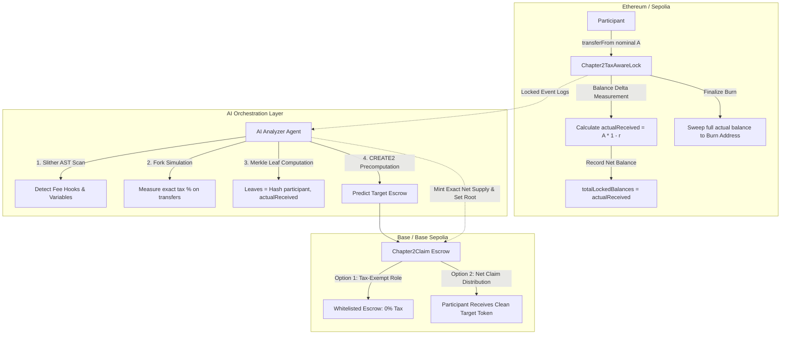

# Specification: Taxed & Non-Standard ERC-20 Community Migration

## 1. Executive Summary

A core value proposition of the Chapter2 migration protocol is replacing naive snapshot-and-airdrop scripts with a cryptographically verified, deterministic migration primitive.

In decentralized communities, many source tokens deviate substantially from the canonical ERC-20 standard (EIP-20). The most prominent class of non-standard assets are **fee-on-transfer (taxed) tokens**, deflationary tokens, rebasing tokens, and tokens with transfer hooks (e.g., maximum transaction limits, blacklists, or ERC-777 callbacks).

If a migration protocol treats a taxed token as a vanilla ERC-20, **critical failure modes occur**:
1. Accounting desynchronization between internal ledgers and actual contract balances.
2. Insolvent finalization burns that permanently freeze participant funds.
3. Target-chain supply mismatches and claim escrow insolvency.

This specification details the vulnerabilities, mathematical modeling, smart contract modifications, and AI agent analysis required to support taxed and non-standard ERC-20 migrations.

---

## 2. Failure Modes in Standard Migration Protocols

### 2.1 The Phantom Inflow Vulnerability (Lock Phase)
In a standard lock contract:
```solidity
// Vulnerable Implementation
function lockForMigration(uint256 amount) external {
    token.safeTransferFrom(msg.sender, address(this), amount);
    totalLockedBalances[msg.sender] += amount;
    totalAssetsLocked += amount;
}
```
If Token $T$ levies a transfer tax $r \in (0, 1)$ (e.g., $r = 0.05$ for a 5% tax):
- The caller sends $A$ tokens.
- The contract receives $A_{\text{received}} = A \times (1 - r)$.
- The tax recipient (marketing, liquidity pool, or burn) receives $A \times r$.
- The contract records $\Delta \text{totalAssetsLocked} = A$.

**Result:** The contract ledger records $A$, but actual token reserves increase by only $A \times (1 - r)$.

### 2.2 The Insolvent Finalization Burn (Finalize Phase)
When migration concludes, the protocol attempts to burn all locked tokens:
```solidity
// Vulnerable Implementation
function burnLockedToBurnAddress() external onlyOwner {
    migrationCompleted = true;
    migrationBlock = block.number;
    token.safeTransfer(BURN_ADDRESS, totalAssetsLocked);
}
```
Since $\text{balanceOf}(\text{this}) = \sum A_{\text{received}} < \text{totalAssetsLocked}$, the call to `safeTransfer` reverts with `ERC20InsufficientBalance`. 

**Impact:** **Catastrophic protocol deadlock.** The owner cannot finalize migration, the `migrationBlock` cannot be captured, and target-chain deployment is blocked.

### 2.3 The Burn Surcharge (Secondary Tax)
If transferring tokens to `0x000000000000000000000000000000000000dEaD` is itself taxed by the token contract:
- Burning balance $B$ results in $B \times (1 - r_{\text{burn}})$ arriving at the burn address.
- $B \times r_{\text{burn}}$ is diverted to tax sinks.
- Subgraph indexers tracking transfers to `BURN_ADDRESS` will observe a lower burned sum than the total balance deducted from the lock contract.

### 2.4 Target Chain Mint Mismatch (Escrow Funding)
When migrating to Base:
- **Scenario A (Clean Target Token):** The community migrates from a taxed source token to a non-taxed, governance-standard target token on Base. The snapshot must reflect either **gross locked tokens** or **net received tokens**. If gross amounts are minted, the target supply exceeds the actual tokens removed from circulation.
- **Scenario B (Taxed Target Token):** The target token also charges fees on transfer. When the claim contract transfers tokens to a participant (`TARGET_TOKEN.safeTransfer(participant, amount)`), the participant receives less than `amount`, or pre-funding the CREATE2 escrow triggers tax deductions, leaving the escrow insolvent for downstream claimants.

---

## 3. Protocol Architecture for Tax-Aware Migrations



---

## 4. Smart Contract Specifications

### 4.1 `Chapter2TaxAwareLock` (Source Chain)

To support arbitrary fee-on-transfer tokens, the lock contract must employ **balance-delta accounting**:

```solidity
contract Chapter2TaxAwareLock is Ownable, ReentrancyGuard {
    using SafeERC20 for IERC20;

    IERC20 public immutable TOKEN;
    address public constant BURN_ADDRESS = 0x000000000000000000000000000000000000dEaD;

    mapping(address participant => uint256) public totalLockedBalances;
    address[] private _migrationParticipants;
    mapping(address participant => bool) private _isMigrationParticipant;

    uint256 public totalAssetsLocked;
    bool public migrationCompleted;
    uint256 public migrationBlock;

    event MigrationLocked(
        address indexed participant,
        uint256 nominalAmount,
        uint256 actualAmountReceived,
        uint256 blockNumber
    );
    event MigrationCompleted(uint256 indexed migrationBlock, uint256 totalBurned);

    constructor(address tokenAddress) Ownable(msg.sender) {
        require(tokenAddress != address(0), "Invalid token");
        TOKEN = IERC20(tokenAddress);
    }

    /// @notice Locks tokens using balance-delta accounting to handle transfer fees accurately.
    function lockForMigration(uint256 amount) external nonReentrant {
        require(!migrationCompleted, "Migration already completed");
        require(amount > 0, "Zero amount");

        uint256 balanceBefore = TOKEN.balanceOf(address(this));
        TOKEN.safeTransferFrom(msg.sender, address(this), amount);
        uint256 actualReceived = TOKEN.balanceOf(address(this)) - balanceBefore;

        require(actualReceived > 0, "No tokens received after fee");

        if (!_isMigrationParticipant[msg.sender]) {
            _isMigrationParticipant[msg.sender] = true;
            _migrationParticipants.push(msg.sender);
        }

        totalLockedBalances[msg.sender] += actualReceived;
        totalAssetsLocked += actualReceived;

        emit MigrationLocked(msg.sender, amount, actualReceived, block.number);
    }

    /// @notice Burns all contract token reserves and captures the finalization block.
    function burnLockedToBurnAddress() external onlyOwner nonReentrant {
        require(!migrationCompleted, "Migration already completed");
        require(totalAssetsLocked > 0, "No assets to burn");

        migrationCompleted = true;
        migrationBlock = block.number;

        // Sweep actual contract balance to guarantee transaction success even with fees
        uint256 currentContractBalance = TOKEN.balanceOf(address(this));
        TOKEN.safeTransfer(BURN_ADDRESS, currentContractBalance);

        emit MigrationCompleted(migrationBlock, currentContractBalance);
    }
}
```

### 4.2 Target Chain Claim Configuration

For target tokens that retain fee-on-transfer functionality:
1. **Fee Exemption Mandate (Preferred):**
   - The project must grant `isExcludedFromFee(address(claimEscrow))` or equivalent tax-exemption permissions to the predicted CREATE2 address **before** pre-funding.
   - This ensures 100% of minted/pre-funded tokens reach claimants without leakage.
2. **Gross-Up Accounting (Alternative):**
   - If the target token does not support fee exclusions, the AI agent must compute the net claim requirement and pre-fund the contract by $\frac{\text{totalLocked}}{1 - r_{\text{target}}}$ so that downstream claims do not run short.

---

## 5. AI Contract Analysis Engine (Detection & Parameterization)

The AI Agent acts as the security and synthesis bridge. Rather than relying on manual human configuration, the agent executes automated bytecode and ABI verification:

### 5.1 Static Analysis (Slither / AST Inspection)
- **Hook Detection:** Parses the source contract AST to detect state variable mutations inside `_transfer` or `transferFrom`.
- **Fee Variable Identification:** Identifies common tax parameters: `taxFee`, `liquidityFee`, `marketingFee`, `burnFee`, `totalFees`, `feeDenominator`.
- **Exclusion Interface Inspection:** Checks if the contract exposes functions like `excludeFromFee(address)`, `setAutomatedMarketMakerPair(address,bool)`, or `isExcludedFromFee(address)`.

### 5.2 Dynamic Fork Simulation
Before proposing migration parameters, the agent spins up a local anvil fork at the current source chain block:
1. Impersonates a representative holder.
2. Executes a test `transfer` and test `transferFrom` of 10,000 units to a dummy lock address.
3. Measures:
   $$\text{Observed Fee Rate} = 1 - \frac{\text{balanceOf}(\text{receiver})_{\text{after}} - \text{balanceOf}(\text{receiver})_{\text{before}}}{\text{nominalTransferAmount}}$$
4. Simulates a transfer from the lock address to `0x...dEaD` to determine whether burning incurs a secondary fee.

### 5.3 Agent Recommendation Matrix

| Source Token Behavior | Target Token Behavior | Recommended Adapter | Pre-funding Strategy |
| --- | --- | --- | --- |
| Standard ERC-20 (0% Tax) | Standard ERC-20 (0% Tax) | `Chapter2Lock` + `Chapter2Claim` | Mint exact `totalAssetsLocked` |
| Fee-on-Transfer ($r > 0$) | Clean ERC-20 (0% Tax) | `Chapter2TaxAwareLock` + `Chapter2Claim` | Mint exact `totalAssetsLocked` (net received) |
| Fee-on-Transfer ($r_1 > 0$) | Fee-on-Transfer ($r_2 > 0$) | `Chapter2TaxAwareLock` + `TaxAwareClaim` | Whitelist claim escrow on target token OR gross-up funding |
| Rebasing Token | Clean ERC-20 | Rebase Share Lock Adapter | Convert shares to underlying snapshot balance |

---

## 6. Additional Non-Standard Token Edge Cases

### 6.1 Tokens with Maximum Transaction / Wallet Limits (`maxTxAmount`)
- **Problem:** Many meme and tax tokens enforce `require(amount <= maxTxAmount)`. A large participant locking their entire balance, or the owner burning `totalAssetsLocked`, exceeds `maxTxAmount` and reverts.
- **Solution:**
  - AI agent inspects `maxTxAmount` in bytecode.
  - If detected, `Chapter2TaxAwareLock` implements batched burning: `burnLockedToBurnAddressChunked(uint256 maxPerChunk)` executed across multiple blocks or calls until contract balance reaches zero.

### 6.2 Pausable and Blacklist Tokens
- **Problem:** Tokens inheriting `Pausable` or maintaining address blacklists (e.g., USDT, USDC, or anti-bot contracts).
- **Solution:**
  - Lock contract verifies token is unpaused prior to opening migration window.
  - Subgraph and Merkle engine flag blacklisted addresses so that locked balances can be evaluated by project governance prior to Merkle root construction.

### 6.3 Reentrancy via ERC-777 / ERC-1363 Callbacks
- **Problem:** Tokens implementing `tokensReceived` or `transferAndCall` hooks invoke untrusted external code on the recipient during transfers.
- **Solution:**
  - Strict compliance with `ReentrancyGuard` on all state-modifying functions (`lockForMigration`, `claim`, `claimGasless`).
  - Strict adherence to Checks-Effects-Interactions (CEI): internal state updated and events emitted *before* executing token transfers.

---

## 7. Implementation Roadmap for Tax Support

1. **Phase 1 (Lock Layer):** Integrate balance-delta accounting into `Chapter2Lock.sol` or deploy `Chapter2TaxAwareLock.sol`.
2. **Phase 2 (Testing):** Add `TestTaxToken.sol` simulating configurable transfer taxes (e.g., 5% to marketing wallet, 2% burned) and verify balance-delta accounting in Foundry.
3. **Phase 3 (Agent Integration):** Integrate Slither AST visitor and local Anvil fork simulation tool into `agent/src/analyzer.py` to classify incoming source token addresses.
